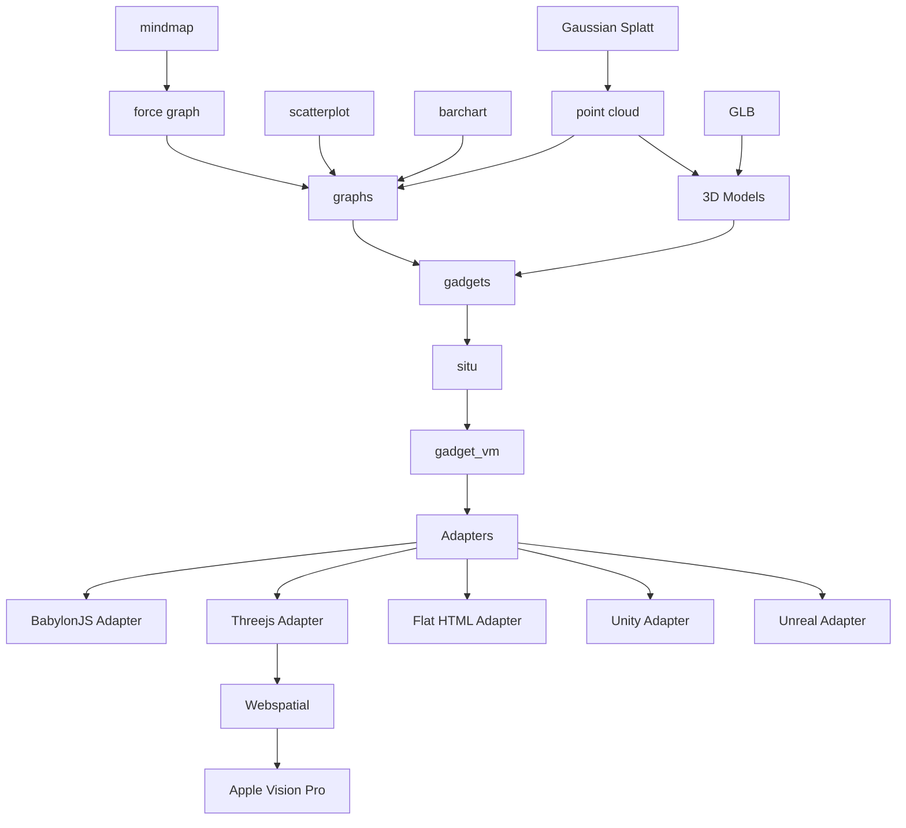

```mermaid
graph TD
    force_graph["force graph"] --> graphs
    scatterplot --> graphs
    barchart --> graphs
    mindmap --> force_graph
    graphs --> gadgets
    gaussiansplat["Gaussian Splatt"] --> pointcloud
    pointcloud["point cloud"] --> 3dmodels
    pointcloud --> graphs
    GLB --> 3dmodels
    3dmodels["3D Models"] --> gadgets
    gadgets --> situ
    situ --> gadget_vm
    gadget_vm --> Adapters
    Adapters --> babylonjs["BabylonJS Adapter"]
    Adapters --> threejs["Threejs Adapter"]
    threejs --> webspatial["Webspatial"]
    webspatial --> avp["Apple Vision Pro"]
    Adapters --> flatthtml["Flat HTML Adapter"]
    Adapters --> unity["Unity Adapter"]
    Adapters --> ue["Unreal Adapter"]
```